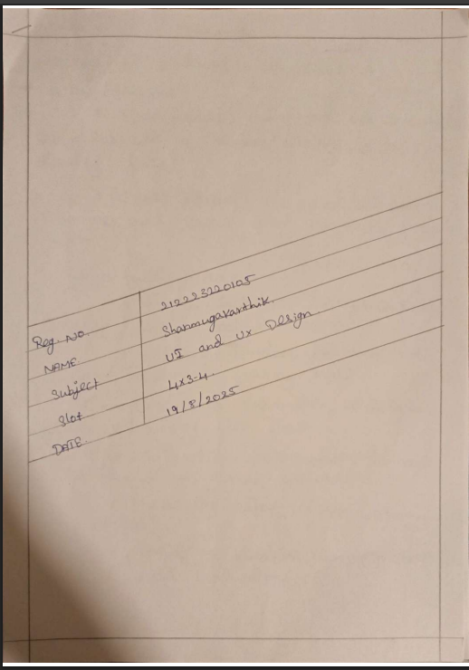
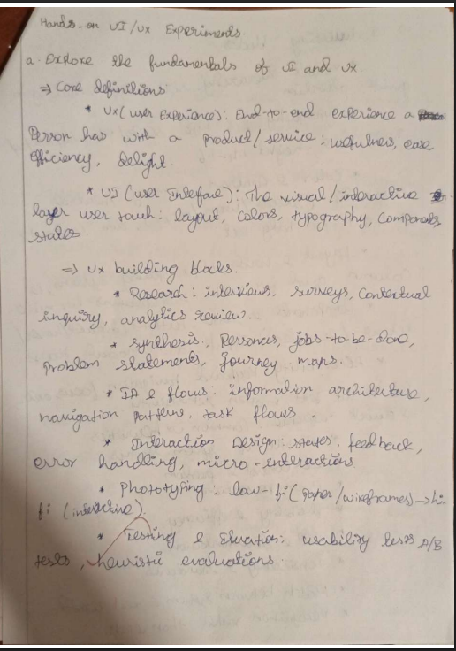
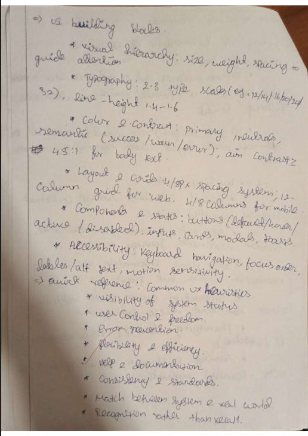
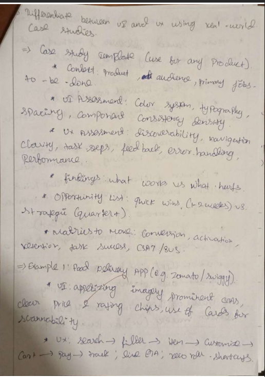
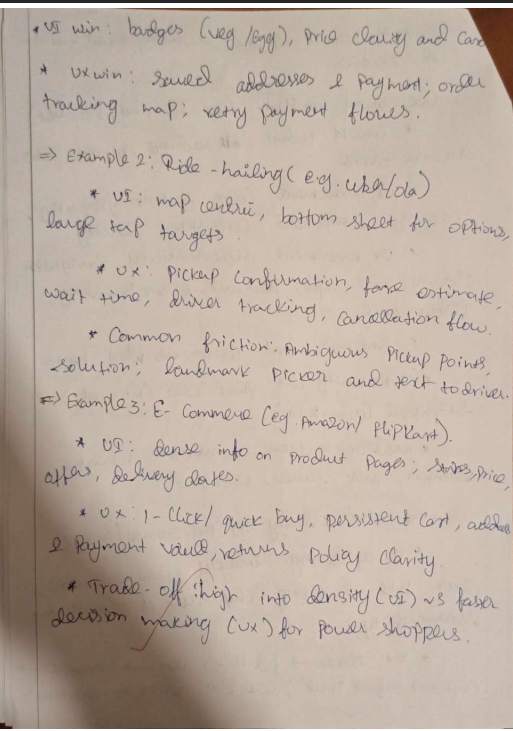
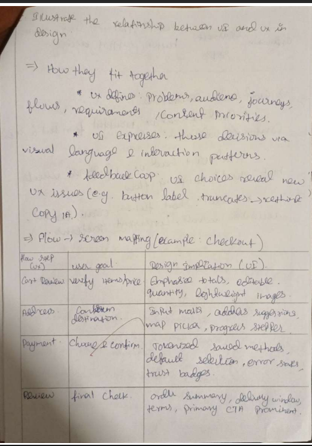
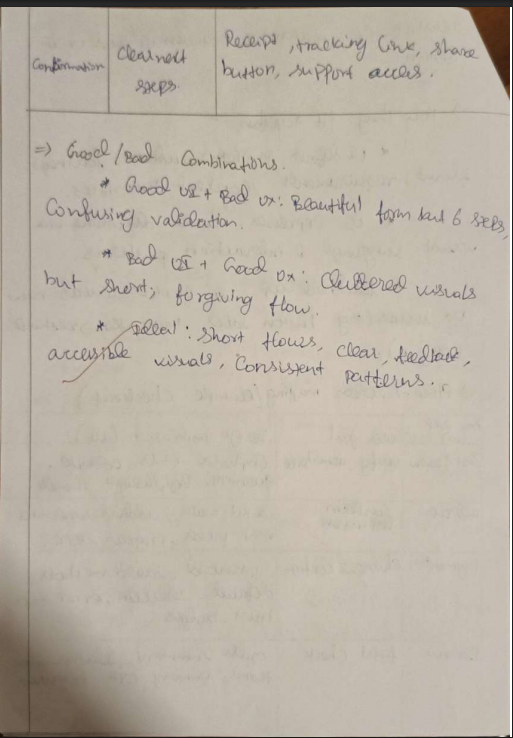
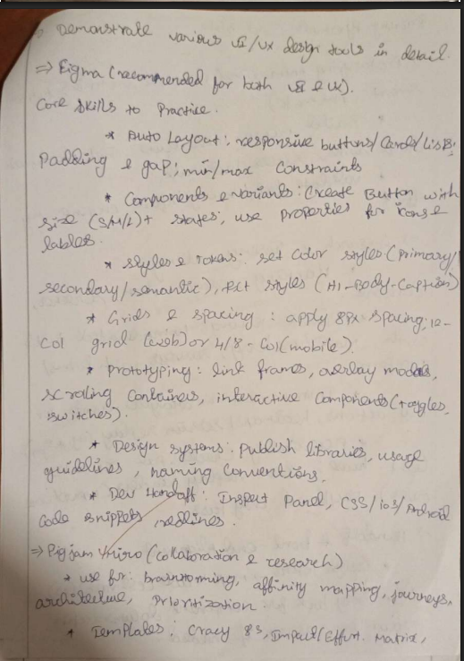
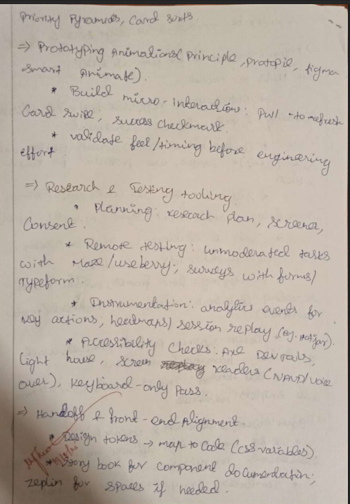

# UI-UX-Experiment1
# NAME: SHANMUGAKARTHIK G
# REG.NO: 212223220105
## Aim:
To explore and apply the fundamentals of UI and UX, distinguish between UI and UX using real-world case studies, illustrate their relationship in design, and demonstrate various UI/UX design tools in detail.
## Algorithm:
1. Define the Problem: Clearly state the challenge to be solved using user-centered design.

2. User Research: Gather insights by conducting interviews, surveys, or observations to understand target user needs and behaviors.

3. Persona Creation: Develop user personas to represent key segments of your audience.

4. Ideation: Generate user stories and scenarios to brainstorm potential solutions.

5. Flow Mapping: Draw flow diagrams and maps to visualize the user journey and interactions.

6. Design: Use UI/UX design tools (such as Figma, Adobe XD, Sketch) to create wireframes, prototypes, and mockups.

7. Testing: Perform usability testing with real users to validate design decisions and identify areas for improvement.

8. Evaluation: Collect and analyze feedback, refine the design, and ensure alignment with user needs and business goals.
## Output:

## Result:
A user-centered UI/UX design process delivers a well-tested, visually appealing, and highly usable product that satisfies end users’ needs.